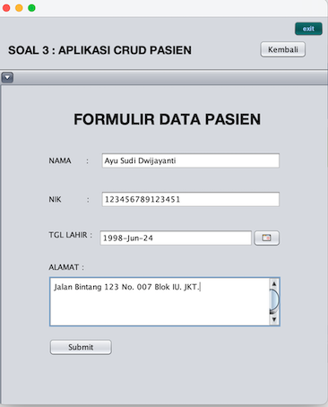

# Java-GUI-App

Created by Ayu Sudi Dwijayanti for Personal Assignment.

Open app with Netbeans version 17 (Apache NetBeans IDE 17).  
Not recommend to open with VSCode.

# GUI Application with Java

- Develop with Apache NetBeans IDE 17. 
- Java with Ant for Java Application.
- Database use PostgreSQL 15. 
- Require Postgres JDBC Driver.
- Requite plugin input jcalendar. 

## Application CRUD Patients Data 

Fitur Read ditampilkan pada halaman utama (Home)  


Terdapat table dan beberapa button untuk fitur Create, Update, Delete dan Exit App.   

Fitur Create ditampilkan pada halaman formulir berikut.  
Setelah pada halaman utama mengklik button "Tambahkan Pasien".  



Terdapat validasi untuk fitur CREATE & UPDATE.   

yaitu  : 
- Semua input wajib di isi.
- Nama harus belum terdaftar (UNIQUE).
- NIK harus belum terdaftar (UNIQUE).
- NIK harus 15 charcter dan terdiri dari angka saja (NUMERIC).
- Tanggal Lahir di input dalam bentuk tanggal. 

Contoh pesan error ditampilkan pada aplikasi   


Pada formulir pasien terdapat tanggal lahir dan cara mengisinya dengan mengklik.   
button choose pada input date, lalu akan tampil kalendar yang dapat dipilih  


Fitur Update dan Delete harus di awali dulu dengan memilih data.  
Memilih data pada halaman utama (Home), apa bila belum di pilih maka akan tampil pesan berikut.  


Fitur Update pada halaman formulir berikut.   
Setelah user memilih data pada halaman utama (Home).  


Untuk fitur delete terdapat konfirmasi penghapusan data.  
Berikut pesan yang di tampilkan.  


# Database Application 

Table yang dibuat bernama **patients** pada database **tp2**   
dengan query DML berikut : 

```sql
CREATE TABLE patients (
    id SERIAL PRIMARY KEY,
    nama character varying(20) UNIQUE,
    alamat text,
    nik character(15) UNIQUE,
    tanggal_lahir date
);
```

Menurut saya untuk alamat lebih tepat data type TEXT karena input bisa lengkap note dan banyak.

Untuk menjalan pembuatan table saat aplikasi baru dijalankan ada pada file bernama `CreateTable.java` dengan config connection pada file `JbdcConn.java`.

Pastikan sebelum menjalankan aplikasi sudah memiliki bentuk database yang serupa dan konfigurasi yang telah disesuaikan.

# HOW TO RUN APP

1. Make sure all package, plugin and SDK is installed: 
- Develop with Java programming language.
- Develop with Apache NetBeans IDE 17. 
- Database use PostgreSQL 15. 
- Require Postgres JDBC Driver.
- Requie plugin input jcalendar. 
2. Open netbeans 
3. Open project choose folder TP2
4. Edit config connection postgres database in file `JbdcConn.java`.
5. Run file `CreateTable.java` 
6. Run application TP2 (`TP2.java`)

